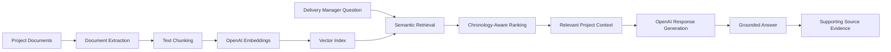

# Delivery Knowledge Assistant

**Live Demo:** [Open the Delivery Knowledge Assistant](https://delivery-knowledge-assistant-nd8xpudpu9hugsvwrxnmdc.streamlit.app/)

An AI-powered project delivery assistant that answers questions from project documents using Retrieval-Augmented Generation (RAG).

## What it demonstrates

- Enterprise document ingestion
- Semantic search using embeddings
- Grounded AI responses
- Chronology-aware retrieval
- Conversational follow-up questions
- Source transparency and evidence inspection
- Hallucination control for unsupported information

## Demo Use Case

The application uses a fully synthetic software-modernization project called **NexusCert Platform Modernization**.

A Delivery Manager can ask questions such as:

- What is the latest working UAT start date?
- What is preventing UAT from starting?
- What changed in Phase 2?
- What are the current project risks?
- Which dependencies are still open?

## Technology

- Python
- Streamlit
- OpenAI API
- OpenAI Embeddings
- NumPy
- python-docx
- openpyxl

## Solution Architecture

## Data Privacy

All project documents included in this repository are synthetic. No real client or confidential informat
cat > README.md <<'EOF'
# Delivery Knowledge Assistant

An AI-powered project delivery assistant that answers questions from project documents using Retrieval-Augmented Generation (RAG).

## What it demonstrates

- Enterprise document ingestion
- Semantic search using embeddings
- Grounded AI responses
- Chronology-aware retrieval
- Conversational follow-up questions
- Source transparency and evidence inspection
- Hallucination control for unsupported information

## Demo Use Case

The application uses a fully synthetic software-modernization project called **NexusCert Platform Modernization**.

A Delivery Manager can ask questions such as:

- What is the latest working UAT start date?
- What is preventing UAT from starting?
- What changed in Phase 2?
- What are the current project risks?
- Which dependencies are still open?

## Technology

- Python
- Streamlit
- OpenAI API
- OpenAI Embeddings
- NumPy
- python-docx
- openpyxl

## Data Privacy

All project documents included in this repository are synthetic. No real client or confidential information is used.
