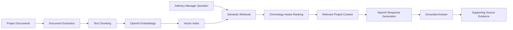

# Delivery Knowledge Assistant

**Live Demo:** [Open the Delivery Knowledge Assistant](https://delivery-knowledge-assistant-nd8xpudpu9hugsvwrxnmdc.streamlit.app/)

An AI-powered project delivery assistant that answers questions from project documents using Retrieval-Augmented Generation (RAG).

## What it demonstrates

- Enterprise document ingestion
- Semantic search using embeddings
- Grounded AI responses
- Chronology-aware retrieval
- Conversational follow-up questions
- Source transparency and evidence inspection
- Hallucination control for unsupported information

## Demo Use Case

The application uses a fully synthetic software-modernization project called **NexusCert Platform Modernization**.

A Delivery Manager can ask questions such as:

- What is the latest working UAT start date?
- What is preventing UAT from starting?
- What changed in Phase 2?
- What are the current project risks?
- Which dependencies are still open?

## Technology

- Python
- Streamlit
- OpenAI API
- OpenAI Embeddings
- NumPy
- python-docx
- openpyxl

## Solution Architecture

## Data Privacy

All project documents included in this repository are synthetic. No real client or confidential informat
cat > README.md <<'EOF'
# Delivery Knowledge Assistant

An AI-powered project delivery assistant that answers questions from project documents using Retrieval-Augmented Generation (RAG).

## What it demonstrates

- Enterprise document ingestion
- Semantic search using embeddings
- Grounded AI responses
- Chronology-aware retrieval
- Conversational follow-up questions
- Source transparency and evidence inspection
- Hallucination control for unsupported information

## Demo Use Case

The application uses a fully synthetic software-modernization project called **NexusCert Platform Modernization**.

A Delivery Manager can ask questions such as:

- What is the latest working UAT start date?
- What is preventing UAT from starting?
- What changed in Phase 2?
- What are the current project risks?
- Which dependencies are still open?

## Technology

- Python
- Streamlit
- OpenAI API
- OpenAI Embeddings
- NumPy
- python-docx
- openpyxl

## Data Privacy

## Key Design Decisions

- **Grounded answers rather than generic AI responses:** The assistant answers only from indexed project artefacts.
- **Chronology-aware retrieval:** When project dates, risks, dependencies or decisions evolve, newer evidence is prioritized while older information can still explain the history.
- **Transparent evidence:** Every answer can expose the supporting document excerpts used by the assistant.
- **Hallucination control:** If the source material does not contain an answer, the assistant states that rather than inventing information.
- **Conversational context:** Follow-up questions such as “What is preventing it from starting?” are rewritten into standalone questions before retrieval.
- **Privacy-safe portfolio design:** The demonstration uses completely synthetic project data rather than real client information.

## Business Value

The Delivery Knowledge Assistant demonstrates how Generative AI can reduce the effort required to understand and govern complex delivery programmes.

For a Delivery or Program Manager, it can help:

- Surface current risks, dependencies and blockers from distributed project artefacts.
- Trace how milestones, commitments and decisions changed over time.
- Reduce manual searching across status reports, meeting minutes and trackers.
- Improve leadership visibility by providing evidence-backed answers.
- Accelerate onboarding of new project or programme stakeholders.
- Support better governance while keeping the human decision-maker in control.

The solution is designed as a practical enterprise AI use case rather than a generic chatbot.

All project documents included in this repository are synthetic. No real client or confidential information is used.
